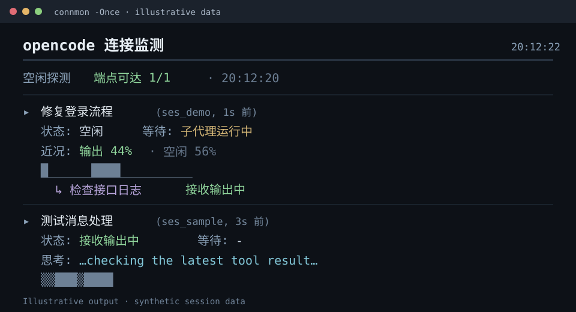
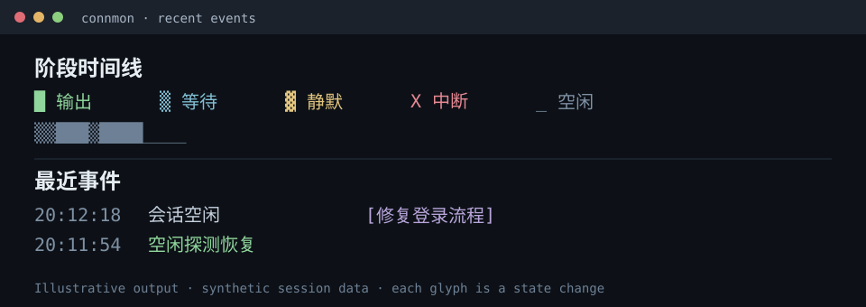

# opencode-connection-status

OpenCode 连接监测插件。OpenCode 桌面端有时无法明确显示连接是否中断，这个项目把会话活动、长时间静默和端点探测结果呈现在终端里。

插件记录已观察到的会话活动，在请求长时间没有输出时检查服务商端点，并在空闲时定期探测已配置的端点。如果服务商提供推理内容，还会显示一小段最近的思考文本。端点有 HTTP 响应，只能说明当时可以访问该端点，不能证明鉴权或模型生成可用。

项目可以与 [retry-forever](#retry-forever) 一起使用：两个插件分别记录和处理请求过程中的不同环节。





## 功能

```
  ══════════════════════════════════════════════════════════════
  opencode 连接监测    20:12:22
  ══════════════════════════════════════════════════════════════
  空闲探测  端点可达 1/1 · 20:12:20

  ▸ 修复登录流程  (ses_demo, 1s 前)
    状态: 空闲  等待: 子代理运行中
    近况: 输出 44% · 空闲 56%
  █______████__________
      ↳ 检查接口日志  接收输出中  等待: -
  ──────────────────────────────────────────────────────────────
  最近事件:
    20:12:18  会话空闲  [修复登录流程]
```

- **分会话面板**：分别显示主会话和子代理的阶段、等待对象、近期活动比例和时间线。
- **等待对象识别**：区分工具执行、子代理运行、上下文压缩、服务商重试和等待模型响应。静默时会根据等待对象采取不同处理。
- **静默监测与探测**：已跟踪的模型请求超过 45 秒没有输出时，检查服务商端点。探测失败会发出警告；探测成功则继续显示为等待中。
- **空闲探测**：即使没有会话产生事件，也按设定间隔在每个 OpenCode 进程中探测一次已配置端点，结果显示在会话面板上方。
- **思考摘要**：服务商提供推理内容时，显示最近 160 个字符；答案正文开始后清除。单凭这段文字，无法判断排队中的哪条后续消息正在处理。
- **会话错误提示**：按鉴权失败、限流、服务端 5xx 错误和网络错误分类。
- **状态文件**：`~/.cache/opencode/connection-status/status.jsonl`，状态每次变化写入一行 JSON，可供脚本读取。

## 安装

在 Windows 上，从仓库根目录运行安装脚本。脚本会备份内容有变化的已安装文件，并在复制后核对 SHA-256：

```powershell
powershell.exe -NoProfile -ExecutionPolicy Bypass -File .\scripts\install.ps1
```

也可以手动把插件复制到 OpenCode 的全局插件目录：

```powershell
# Windows（PowerShell）
New-Item -ItemType Directory -Force "$env:USERPROFILE\.config\opencode\plugin" | Out-Null
Copy-Item connection-status.ts "$env:USERPROFILE\.config\opencode\plugin\"
Copy-Item retry-forever.ts "$env:USERPROFILE\.config\opencode\plugin\"   # 可选的重试插件
```

```bash
# macOS / Linux
mkdir -p ~/.config/opencode/plugin
cp connection-status.ts retry-forever.ts ~/.config/opencode/plugin/
```

重启 OpenCode 后，插件会从该目录自动加载，无须修改配置。

### 终端查看器（可选）

`connmon.ps1` 是直接读取状态文件的终端面板：

```powershell
.\connmon.ps1                 # 实时查看，每秒刷新
.\connmon.ps1 -Once           # 只显示一次
.\connmon.ps1 -IntervalSec 2  # 每 2 秒刷新
.\connmon.ps1 -All            # 包含更早的会话及所有子代理
```

如果希望在任意终端输入 `connmon`，可创建命令入口：

```powershell
# 1. 创建入口脚本
New-Item -ItemType Directory -Force "$env:USERPROFILE\bin" | Out-Null
Copy-Item connmon.ps1 "$env:USERPROFILE\.config\opencode\"
@"
@echo off
powershell.exe -NoProfile -ExecutionPolicy Bypass -File "%USERPROFILE%\.config\opencode\connmon.ps1" %*
"@ | Set-Content "$env:USERPROFILE\bin\connmon.cmd" -Encoding ASCII

# 2. 将 ~/bin 永久加入用户 PATH（只需一次）
$userPath = [Environment]::GetEnvironmentVariable("PATH", "User")
[Environment]::SetEnvironmentVariable("PATH", "$userPath;$env:USERPROFILE\bin", "User")
```

打开**新的**终端后运行：

```text
connmon                 实时面板，每秒刷新
connmon -Once           显示一次后退出
connmon -IntervalSec 2  自定义刷新间隔
```

> 编码说明：`connmon.cmd` 使用 Windows PowerShell 5.1；脚本会以 UTF-8 读取状态文件。如果直接在旧版控制台运行 `connmon.ps1` 时中文乱码，可先运行 `chcp 65001`，或改用 Windows Terminal。

## 使用说明

### 面板各行的含义

```
  ▸ 修复登录流程  (ses_demo, 1s 前)         ← 会话标题、短 ID、数据距今时间
    状态: 空闲  等待: 子代理运行中           ← 当前阶段与等待对象
    思考: …正在检查最新工具结果…           ← 服务商提供时显示推理摘要
    近况: 输出 44% · 空闲 56%              ← 近期各阶段所占时间
  █______████__________                    ← 阶段时间线，每个字符代表一次状态变化
      ↳ 检查接口日志                        ← 挂在主会话下的子代理
```

- **状态**：最近一次采样的阶段。`空闲` 表示没有活跃轮次；`等待模型响应` 表示请求已发出；`接收输出中` 表示正在输出；`静默（疑似卡住）` 表示超过静默阈值并正在探测；`连接中断` 表示端点探测失败。
- **等待**：最近观察到的等待对象，例如 `模型思考/响应`、`工具执行 · bash (npm test)`、`子代理运行中`、`上下文压缩`、`第 N 次重试`。没有其他等待对象的模型请求才可能触发静默探测。
- **思考**：服务商输出推理内容时才显示；答案正文开始或当前轮次结束后清除。有些模型不会输出这类内容。
- **近况**：近期采样窗口内各阶段的时间占比，避免只看一条空闲快照就误判整个会话。
- **阶段时间线**：`█` 输出（绿）、`▒` 等待（青）、`▓` 静默（黄）、`X` 中断（红）、`_` 空闲（灰）。字符代表状态变化，疏密受状态变化频率影响；阅读时也要看时间跨度。

### 常见情形

**“主代理显示思考，但看起来没有动静”**：查看主面板的等待对象及子代理面板。`等待: 子代理运行中` 表示已派发子任务。主代理出现新的推理内容说明它恢复了输出；监测器无法把这段输出对应到某条具体的排队消息。

**“面板显示静默（疑似卡住）”**：已跟踪的模型请求超过静默阈值，插件正在检查服务商端点。端点可达时仍显示等待；探测失败时发出提示。

**“提示仍在等待”**：工具、子代理或上下文压缩的运行时间超过再次提醒间隔。这是活动提示，不代表连接故障。

**“提示连接中断”**：静默请求期间的端点探测失败。恢复输出后，会显示绿色的 `连接已恢复` 提示。

**“空闲探测发出警告”**：至少一个已配置端点没有响应。标题区会显示响应数量；同一故障状态只提醒一次。探测不会发送模型生成请求。

### 状态文件

`~/.cache/opencode/connection-status/status.jsonl` 在每次状态变化时写入一行 JSON：

```json
{"t":"2026-09-22T12:31:27.000Z","phase":"streaming","wait":"tool","waitDetail":"bash (npm test)","waitSec":12,"sinceOutageMs":0,"sessionID":"ses_…","sessionTitle":"…","parentID":"","isAgent":false,"thinking":"…"}
```

带有 `"scope":"connection"` 的行记录进程级空闲探测。会话行包含 `sessionID`；可以在 PowerShell 中用 `Get-Content ... -Wait -Tail 1`，或在 macOS/Linux 中用 `tail -f` 持续查看。

## 配置

以下环境变量均可选：

| 变量 | 默认值 | 作用 |
|---|---|---|
| `OPENCODE_CONN_SILENCE_MS` | `45000` | 模型请求静默多久后开始探测 |
| `OPENCODE_CONN_RENOTIFY_MS` | `120000` | 长时间等待或持续故障的再次提醒间隔 |
| `OPENCODE_CONN_PROBE_TIMEOUT_MS` | `5000` | 单次探测超时时间 |
| `OPENCODE_CONN_IDLE_PROBE_MS` | `60000` | 空闲探测间隔 |
| `OPENCODE_CONN_STATUS_FILE` | 用户缓存目录 | 覆盖状态文件路径，可用于隔离测试 |

## 工作方式

插件按会话结合两类信息：

1. **事件总线**：`message.part.updated`（推理快照、工具执行、子任务派发、重试）、`session.next.*.delta`（OpenCode 2.x 的推理和文本增量）、`session.error`、`session.idle`。能够归属到具体会话的事件主要来自这里。
2. **封装后的 `globalThis.fetch`**：统计向服务商端点发出的在途请求；端点地址来自配置中的 `provider.<id>.options.baseURL`。请求体不含会话 ID，因此在途计数属于进程级信息，暂时关联最近活跃的会话；后续输出事件可进一步校正归属。

监测循环每 5 秒检查一次各会话，包括活动记录、静默识别、探测与恢复提示。

### 阶段含义

| 阶段 | 含义 |
|---|---|
| `idle` | 没有活跃轮次 |
| `waiting` | 请求已发出，尚未观察到输出 |
| `streaming` | 正在输出 |
| `stalled` | 请求仍在途，超过静默阈值，正在探测 |
| `down` | 静默请求期间端点探测失败 |

### 子代理运行时如何看主会话

主面板会记录已派发的子任务，直到主会话产生新输出或当前轮次结束。子面板显示各子代理自己的活动。这些信息可以判断哪个会话有活动；事件本身无法说明某段推理文字对应哪条排队中的用户消息。

## retry-forever

`retry-forever.ts` 用于在服务商出现临时故障时维持长时间运行的会话。OpenCode 内置重试在有限次数后会放弃，部分 DNS 故障和网关 5xx 错误也可能没有匹配到；最终会话可能因 `Failed to drain Session` 结束。该插件在 OpenCode 1.x 中封装 `globalThis.fetch`，在 2.x 中使用 AI SDK 的语言模型钩子，让符合条件的重试发生在会话运行器之下。

可选环境变量：

| 变量 | 默认值 | 作用 |
|---|---|---|
| `OPENCODE_RETRY_DELAY_MS` | `250` | 重试之间的基础延迟 |
| `OPENCODE_RETRY_MAX_ATTEMPTS` | `0`（不限次数） | 单次请求的最多尝试次数 |
| `OPENCODE_RETRY_HONOR_RETRY_AFTER` | `true` | 是否遵循 `Retry-After` 响应头 |
| `OPENCODE_RETRY_VERBOSE` | `true` | 是否将每次重试写入标准错误输出 |

## 卸载

```powershell
# 插件
Remove-Item "$env:USERPROFILE\.config\opencode\plugin\connection-status.ts"
Remove-Item "$env:USERPROFILE\.config\opencode\plugin\retry-forever.ts" -ErrorAction SilentlyContinue

# 终端查看器
Remove-Item "$env:USERPROFILE\.config\opencode\connmon.ps1" -ErrorAction SilentlyContinue
Remove-Item "$env:USERPROFILE\bin\connmon.cmd" -ErrorAction SilentlyContinue

```

然后重启 OpenCode。状态历史和部署备份会留在本地，供后续检查。

## 已知限制

- **思考内容的显示还需要更多服务商的实际反馈。** 它依赖推理事件，有些模型不会发送这类事件。摘要也无法指明正在处理哪条具体的用户消息。OpenCode 1.x 与 2.x 的事件格式不同；2.x 路径已有离线测试，但本项目尚未用真实的 2.x 会话验证。反馈问题时请附上 OpenCode 版本、模型和服务商类型。
- 端点探测只检查 HTTP 可达性。即使返回 401 或 404，也说明端点给出了响应；鉴权和模型生成需要真正发送模型请求才能验证。
- 时间线展示状态变化。现有 OpenCode 事件不能可靠提供每个并发会话的上传、下载字节数，因此“近况”百分比不标为网络吞吐量。

## 技术文档

- [架构与实现说明](docs/ARCHITECTURE.md)：内部工作方式、部署、验证结果和当前限制。
- [项目进度](PROGRESS.md)与[设计决策](DECISIONS.md)：当前状态和主要取舍。

## 参与改进

欢迎提交问题与 PR，尤其欢迎不同模型和服务商的测试结果。提交问题时请附上 OpenCode 版本、模型和服务商类型；各服务商的推理事件格式可能不同。

## 许可证

MIT
