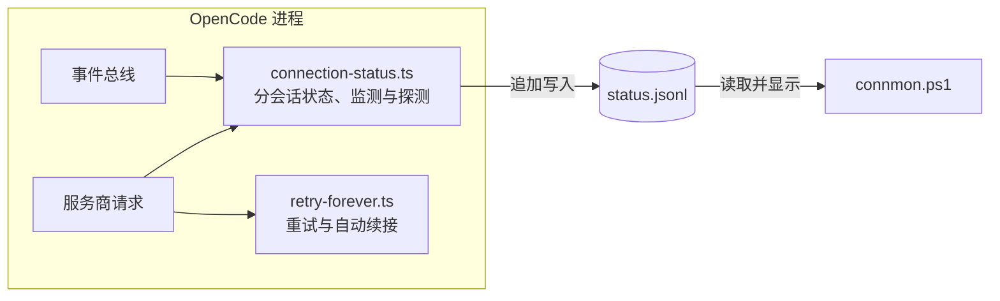

# 架构与实现说明

本文介绍 `connection-status.ts`、`retry-forever.ts` 和 `connmon.ps1` 的内部工作方式，以及相应的验证证据。使用方法见 [README](../README.md)。

## 1. 总体架构

三个组件形成一条数据链：

两个插件运行在 OpenCode 进程内，分别从事件总线（OpenCode 上报的活动）和封装后的 `globalThis.fetch`（发出的网络请求）获取信息。监测插件把状态追加写入 JSONL 文件；终端查看器读取文件并显示。查看器不直接连接 OpenCode，因此即使 OpenCode 暂时无响应，已有记录仍可查看。

## 2. connection-status.ts

### 2.1 分会话状态

状态存放在 `Map<sessionID, State>` 中。每个 `State` 记录阶段、等待对象、最近的思考文本、故障跟踪，以及标题、`parentID`、`isAgent` 等元数据。

早期版本只使用一个全局状态。多个会话并行时，子代理的输出会被算作主会话的活动，主代理等待 Task 工具时也可能被显示成正在思考。各会话事件交错到达，需要按会话分别保存状态才能正确归属。

仅凭网络请求无法确认它属于哪个会话：请求体没有会话 ID。因此在途请求计数保存在全局跟踪器中，暂时关联事件流最近涉及的会话；输出到达后再借助事件校正。空闲探测属于整个进程，单独写入 `scope: "connection"` 记录。

### 2.2 事件映射

插件兼容两代 OpenCode 事件格式：

| 内容 | OpenCode 1.x | OpenCode 2.x |
|---|---|---|
| 推理内容 | `message.part.updated` 且 `part.type === "reasoning"`（完整快照，可能超过 100 KB） | `session.next.reasoning.delta`（增量） |
| 答案正文 | 同一事件，`part.type === "text"` | `session.next.text.delta` |
| 工具执行 | `part.type === "tool"`，含 `state.status` | 同左 |
| 子任务派发 | `part.type === "subtask"` | 同左 |
| 重试 | `part.type === "retry"`，含 `attempt` | 同左 |
| 轮次结束 | `part.type === "step-finish"` / `session.idle` | 同左 |

这个区别来自真实会话中的事件类型记录：OpenCode 1.18.31 在一次轮次中产生了 183 条 `message.part.delta` 和 12 条 `message.part.updated` 快照；推理内容只出现在快照中，当时没有 2.x SDK 使用的专门推理增量事件。

思考摘要取已观察到的推理文本最后 160 个字符。答案正文开始或轮次结束时清除。事件流没有把推理片段与具体的排队后续消息关联起来，因此查看器只显示片段，不推断其对应哪条消息。

### 2.3 等待对象分类

静默可能有不同原因。插件按优先级区分五种等待对象：

1. `retry`：OpenCode 已记录重试事件，正在重新请求。
2. `compaction`：摘要模型正在压缩上下文。
3. `subtask`：Task 工具已派发子代理。
4. `tool`：工具调用的 `state.status === "running"`。
5. `model`：模型请求在途，且没有上述其他等待对象。

前四种情况下，短时没有模型输出符合预期，监测循环不会因此探测连接。它按再次提醒间隔（默认 2 分钟）显示一次 `wait-notice`，让长时间运行的工具仍可见，同时避免重复刷屏。

只有模型请求在途、没有其他等待对象，并且超过 `silenceMs`（默认 45 秒）没有输出时，才会触发静默探测。

### 2.4 端点探测

探测使用从 `provider.<id>.options.baseURL` 发现的服务商地址，向其 `/models` 路径发送 GET 请求，默认 5 秒超时。请求带有标记头，避免被 fetch 封装层计入模型请求。任何 HTTP 响应都算端点可达，包括 401 和 404；这只能说明当时有响应，不能验证鉴权或模型生成。无法明确归类的错误倾向于按可达处理；明确的网络失败和超时才算探测失败。

探测结果：

- **可达**：写入 `probe-ok`，模型请求继续显示为等待。
- **不可达**：将阶段标为 `down`，提示一次 `静默 Ns 且探测不通 — 连接中断`；恢复输出后提示 `连接已恢复`。端点探测失败表明连接有问题，但不能据此确定模型服务的故障原因。

探测请求带有 `x-opencode-conn-probe` 请求头；fetch 封装层据此跳过探测请求，避免递归或错误地延长等待时间。

### 2.5 Fetch 封装

`armFetchTracking` 在每个进程中封装一次 `globalThis.fetch`。由于插件文件可能在项目级和全局级作用域中重复求值，代码用 `Symbol.for` 键防止重复封装。请求主机匹配已配置服务商端点时，在发送时增加计数，完成时减少计数，并把活跃会话阶段改为 `waiting`。

实现时需要注意两点：

- 请求体可能是流，第一次发送就会消耗它。这个封装层不负责重试，因此无须重放请求体；`retry-forever` 单独处理重放。
- 自身发起的探测不能计入模型请求。

### 2.6 监测循环与活动记录

单个 5 秒定时循环遍历各会话，处理活动记录、恢复、等待提醒、静默检查和空闲状态更新。如果没有在途模型请求，还会执行一次进程级空闲探测，检查每个已配置端点。即使没有任何会话事件，它也照常运行；结果记录端点数量，只在状态变化时弹出提示。

活动记录按会话使用 `phase|wait|waitDetail|thinking-tail` 去重。这样空闲会话不会持续写入，活跃会话也只在可观察信息变化时写入，避免状态文件随每个 token 无节制增长。思考摘要参与去重键，因此推理进展仍能显示出来。

## 3. retry-forever.ts

### 3.1 问题背景

OpenCode 内置重试在有限次数后停止，且可能漏掉 DNS 故障、部分网关 5xx 错误等实际故障。重试耗尽后，`SessionRunner.drain` 抛出 `Failed to drain Session`，会话随之结束；运行数小时的任务尤其容易受到影响。

### 3.2 两代版本的接入位置

**OpenCode 1.x** 的服务商流量经过 `globalThis.fetch`，因此可在这一层封装请求。它与 `connection-status` 共用防止重复封装的 Symbol 机制，并增加重试逻辑。遇到可重试的 HTTP 状态码（408、409、425、429、5xx）或网络层异常时，按退避间隔重试，并遵循 `Retry-After` 响应头。

**OpenCode 2.x** 的服务商流量不经过插件可封装的 fetch。接入位置是 `aisdk.hook("language", ...)`：服务商通过该钩子设置 `input.language`，随后注册的钩子能取得已构建的模型，并封装 `doStream` / `doGenerate`。流一旦开始输出，重新启动会向下游重复发送内容；因此这里只重试首段输出之前的故障，后续故障交给 OpenCode 自身的重试机制。

模块通过一个默认导出提供两种入口形式：1.x 使用 `server`，2.x 使用 `setup`。两个大版本对插件结构的校验不同，加载时会拒绝不适合的结构。

### 3.3 自动续接

传输层重试无法挽救服务商在输出中途结束、且结束原因是 `finish: "unknown"` 的轮次。1.x 通过重发用户原有文本恢复，并以“会话 + 提示文本”去重，因为重发会生成新的消息 ID；2.x 在内置重试耗尽后发出 `session.execution.failed`，续接逻辑再发送合成的 “continue”。

续接逻辑排除主动终止：输出 0 个 token 的 `unknown` 结束可能来自权限拒绝、上下文压缩或用户中断，不应自动续接。只有已产生输出、随后无明确原因地停止的轮次才按中断处理；用户中断的轮次不会恢复。每个会话的连续失败次数受 `maxAttempts` 限制，成功或中断后清零。

### 3.4 与 connection-status 的关系

`retry-forever` 在会话层以下处理符合条件的临时故障。`session.error` 只报告 OpenCode 仍向会话暴露的错误；单看这个事件，无法判断此前走过哪条重试路径。

## 4. connmon.ps1

查看器是独立的 PowerShell 脚本，不依赖正在运行的 OpenCode。它读取 `status.jsonl` 最后 600 行，分离进程级探测记录，按 `sessionID` 汇总会话采样，并将子代理放在父会话下。默认最多显示 5 个近期主会话，以及每个主会话下的 3 个子代理；`-All` 可展开更多内容。它显示：

- **阶段时间线**：每个字符表示最近 24 条采样中的一次状态变化。`█` 输出、`▒` 等待、`▓` 静默、`X` 中断、`_` 空闲；字符并不对应等长时间或上传下载字节数。
- **活动百分比**：按相邻采样的时间间隔加权计算，每段最多计 300 秒，避免设备休眠导致空闲比例失真。
- **重要事件**：故障、恢复、等待提醒和错误；会话事件附带标题。常规的成功空闲探测只出现在页首，不占用最近事件列表。

编码方面，脚本显式设置 `[Console]::OutputEncoding = UTF8`，以免阶段图符号在 ANSI 编码下损坏；读取文件时也使用 `Get-Content -Encoding UTF8`。在部分中文区域设置中，Windows PowerShell 5.1 默认按 GBK 读取，曾导致中文会话标题乱码。

PowerShell 5.1 还有几处容易出错的行为：`Seg` / `Line` 辅助函数使用 PSCustomObject，避免 `@()` 在调用处意外展开嵌套数组；`Line` 通过 `$args` 收集参数，避免类型化参数吞掉第一个参数之后的内容；阶段字符通过哈希表查询，避免 `switch` 展平嵌套数组。此前这三处都曾造成不同的渲染问题。

## 5. 验证

在仓库根目录运行 `npm test`。测试套件把 SDK 兼容层和状态文件放在临时目录，不会修改已安装 OpenCode 的状态日志。本地 HTTP 服务器用于模拟可达、连接重置和长时间无响应的端点。

| 测试套件 | 当时结果 | 主要覆盖内容 |
|---|---:|---|
| `tests/plugin.test.mjs` | 25/25 | 无服务商 RPC 时启动、会话分离、推理内容、错误、等待对象、静默与空闲探测、fetch 清理和重新加载 |
| `tests/retry-forever.test.mjs` | 18/18 | 续接判断、尝试次数上限、1.x fetch 重试与请求体重放、2.x 首段输出前的语言模型钩子重试 |
| `tests/connmon.test.ps1` | 1/1 | Windows PowerShell 5.1 中的进程级探测标题和完整等待事件渲染 |

监测插件测试验证：没有会话时仍执行空闲探测；两个会话不会让同一探测周期重复发出请求；警告和恢复只在状态变化时出现。模型请求挂起时会触发失败探测，恢复输出后显示恢复提示。重试测试分别用先返回 503 再返回 200 的服务检查请求体重放、用网络错误检查尝试次数上限，并用模拟的 2.x 语言模型钩子检查首段流式输出之前的重试。

2026-09-24，曾单独启动一个新安装的 OpenCode 1.x 服务进程，将空闲探测间隔设为 1 秒，并保持没有会话活动。其本地配置接口返回 HTTP 200；插件先后写入 `connection-configured` 和 `idle-probe-ok`，后者显示 `reachable: 1`、`total: 1`。已安装的 `connmon` 命令也显示了进程级探测结果，随后该临时服务进程已停止。这验证了本机新进程的空闲探测路径；当时已经运行的桌面进程仍加载旧版内存代码。

在 Windows 上运行 `npm run test:viewer` 可复测终端渲染。手动查看命令为 `powershell.exe -NoProfile -ExecutionPolicy Bypass -File .\connmon.ps1 -Once`；也可通过 `-StatusFile` 指定样例状态文件。这些检查只能确认脚本能解析和显示快照，不能证明已运行的 OpenCode 进程重新加载了刚部署的插件。

### 当前限制

- 1.x 的 fetch 封装只把请求统计到收到响应头为止。如果流式响应之后长时间暂停，而 OpenCode 又没有发出事件、也没有在途请求，监测器可能无法识别这段静默。
- 端点探测只检查 HTTP 可达性，不验证鉴权、模型生成能力或同一服务商地址下的所有路由。
- 2.x 语言模型钩子路径已用模拟模型测试；本次审计没有用真实的 2.x 服务商会话验证。
- 会话事件无法可靠地把网络请求分配给多个并发会话中的某一个，也无法判断推理摘要对应哪条排队中的用户消息。
- 状态文件只追加写入；查看器只读取末尾，尚未实现轮转。旧调试过程留下的大型诊断日志位于仓库外，需要另行进行本地清理。

### 部署

把 `connection-status.ts` 和 `retry-forever.ts` 复制到 OpenCode 全局插件目录，并将 `connmon.ps1` 放到选定的命令入口位置。比较源码与已安装副本的 SHA-256。正在运行的 OpenCode 进程会保留原先加载的插件代码，直到重启。配置和状态数据应留在公开仓库之外。
