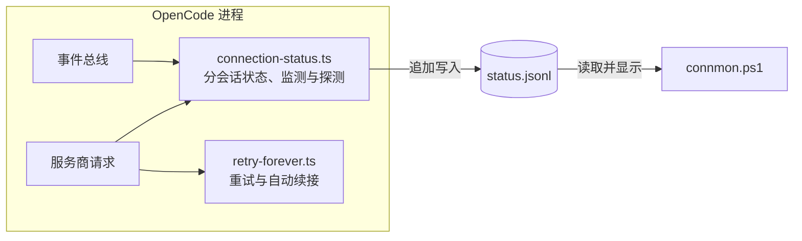

# 架构与实现说明

本文介绍 `connection-status.ts`、`retry-forever.ts` 和 `connmon.ps1` 的内部工作方式，以及相应的验证证据。使用方法见 [README](../README.md)。

## 1. 总体架构

三个组件形成一条数据链：

```mermaid
flowchart LR
    subgraph P[OpenCode 进程]
        E[事件总线] --> C[connection-status.ts<br/>分会话状态、监测与探测]
        F[服务商请求] --> C
        F --> R[retry-forever.ts<br/>重试与自动续接]
    end
    C -->|追加写入| J[(status.jsonl)]
    J -->|读取并显示| V[connmon.ps1]
```

两个插件运行在 OpenCode 进程内，分别从事件总线（OpenCode 上报的活动）和封装后的 `globalThis.fetch`（发出的网络请求）获取信息。监测插件把状态追加写入 JSONL 文件；终端查看器读取文件并显示。查看器不直接连接 OpenCode，因此即使 OpenCode 暂时无响应，已有记录仍可查看。

## 2. connection-status.ts

### 2.1 分会话状态

状态存放在 `Map<sessionID, State>` 中。每个 `State` 记录阶段、等待对象、最近的思考文本、故障跟踪，以及标题、`parentID`、`isAgent` 等元数据。

早期版本只使用一个全局状态。多个会话并行时，子代理的输出会被算作主会话的活动，主代理等待 Task 工具时也可能被显示成正在思考。各会话事件交错到达，需要按会话分别保存状态才能正确归属。

仅凭网络请求无法确认它属于哪个会话：请求体没有会话 ID。因此在途计数属于进程级信息；请求开始时关联事件流最近涉及的会话，之后不会因其他会话事件而转移计数。这种归属仍是近似的。会话忙碌状态另由事件记录，能够覆盖未经过 fetch 封装的请求。空闲探测单独写入 `scope: "connection"`，记录增加 `processID` 以区分进程。

### 2.2 事件映射

插件兼容两代 OpenCode 事件格式：

| 内容 | OpenCode 1.x | OpenCode 2.x |
|---|---|---|
| 推理内容 | `message.part.updated` 且 `part.type === "reasoning"`（完整快照，可能超过 100 KB） | `session.next.reasoning.delta`（增量） |
| 答案正文 | 同一事件，`part.type === "text"` | `session.next.text.delta` |
| 工具执行 | `part.type === "tool"`，含 `state.status` | 同左 |
| 子任务派发 | `part.type === "subtask"` | 同左 |
| 重试 | `part.type === "retry"`，含 `attempt` | 同左 |
| 轮次结束 | `part.type === "step-finish"` / `session.idle` | 同左 |
| 忙碌、空闲、重试 | `session.status` | 提供该事件时同左 |

`message.part.delta` 的文本字段增量也会更新静默时钟。推理或正文的类型来自此前的 `message.part.updated`；只缓存最多 1,000 个片段类型，不缓存完整消息。空片段只声明类型，不算模型输出。`step-finish` 结束单个生成步骤，不独自宣告整个会话空闲；忙碌会话等待后续步骤，最终由空闲事件结束。

`message.updated` 提供消息角色；已知用户消息的文本快照和增量不计为模型输出。角色信息也限制为最多 1,000 条，避免保存完整对话。

这个区别来自真实会话中的事件类型记录：OpenCode 1.18.31 在一次轮次中产生了 183 条 `message.part.delta` 和 12 条 `message.part.updated` 快照；推理内容只出现在快照中，当时没有 2.x SDK 使用的专门推理增量事件。

思考摘要取已观察到的推理文本最后 160 个字符。答案正文开始或轮次结束时清除。事件流没有把推理片段与具体的排队后续消息关联起来，因此查看器只显示片段，不推断其对应哪条消息。

### 2.3 等待对象分类

静默可能有不同原因。插件按优先级区分五种等待对象：

1. `retry`：OpenCode 已记录重试事件，正在重新请求。
2. `compaction`：摘要模型正在压缩上下文。
3. `subtask`：Task 工具已派发子代理。
4. `tool`：工具调用的 `state.status === "running"`。
5. `model`：模型请求在途，且没有上述其他等待对象。

前四种情况下，短时没有模型输出符合预期，监测循环不会因此探测连接。它按再次提醒间隔（默认 2 分钟）显示一次 `wait-notice`，让长时间运行的工具仍可见，同时避免重复刷屏。

会话仍忙碌或模型响应正文仍在途、没有其他等待对象，并且超过 `silenceMs`（默认 45 秒）没有输出时，才会触发静默探测。初次探测后按 `probeIntervalMs`（默认 60 秒）重探，与 `renotifyMs` 的提示间隔独立。

### 2.4 端点探测

探测使用配置钩子传入的 `provider.<id>.options.baseURL`，保留 `/v1`、`/api/v3` 等路径，在末尾追加 `/models`，发送 GET 请求，默认 5 秒超时。旧版丢弃 API 路径的行为已修正。请求不携带 API Key、鉴权头、URL 用户信息或查询参数。任何 HTTP 响应都算端点可达，包括 401、404 和 503；这只能说明当时有响应，不能验证鉴权或模型生成。无法明确归类的错误倾向于按可达处理；明确的网络失败和超时才算探测失败。

探测结果：

- **可达**：写入 `probe-ok`，模型仍没有输出时保留 `stalled`。端点恢复不等同于模型输出恢复。
- **不可达**：将阶段标为 `down`，写入 `probe-fail`，后续继续定期探测。首次故障提示之后，按 `renotifyMs` 再次提示；恢复模型输出才提示 `连接已恢复，输出正常`。

探测请求带有 `x-opencode-conn-probe` 请求头；监测和重试封装均跳过该请求。收到响应头后取消未使用的探测正文。同一端点的同时探测共用一个 Promise；探测结束后等待配置间隔再发起下一次，慢请求不会层叠。探测期间若已有输出、空闲、取消或配置更新，过期结果不会覆盖新状态。监测循环中的提示在后台执行，不阻塞下一周期。

### 2.5 Fetch 封装

`armFetchTracking` 在每个进程中封装一次 `globalThis.fetch`。请求 URL 匹配已配置服务商的基地址和路径时，在发送时增加计数，并把活跃会话阶段改为 `waiting`。正文通过按需读取的 `ReadableStream` 原样转发；直到读完、取消、网络失败或 AbortSignal 终止才释放计数，释放有去重保护。响应的状态、响应头、URL、重定向标记和类型保留。

旧版收到响应头就减少计数，可能漏掉流式正文的首段等待和中途停顿。`fetch()` 在响应状态和响应头到达后即返回，正文尚可继续读取，参见 [MDN](https://developer.mozilla.org/en-US/docs/Web/API/Fetch_API/Using_Fetch#handling_the_response)。新版不克隆、预读或缓存完整正文，保留下游读取与取消行为。

实现时需要注意两点：

- 请求体可能是流，第一次发送就会消耗它。这个封装层不负责重试，因此无须重放请求体；`retry-forever` 单独处理重放。
- 自身发起的探测不能计入模型请求。

### 2.6 监测循环与活动记录

同一进程的所有插件实例通过 `Symbol.for` 共用状态、fetch 跟踪器和监测循环。各实例的配置按基地址合并去重；实例退出时移除其配置，最后一个退出才停止循环并恢复 fetch。默认调度周期为 1 秒，较短设置下最低 50 毫秒；连续推理每 5 秒采样。

空闲探测条件是：没有在途请求、没有忙碌会话，也没有已知工具、子代理、压缩或重试等待。配置就绪后的下一周期首次检查，之后按空闲间隔运行。没有任何会话事件时仍可执行；故障和恢复提示只在探测结果改变时出现。多个独立 OpenCode 进程仍各自运行。

阶段、等待对象、是否含推理文本及元数据变化立即去重落盘；连续推理文本尾部变化在 5 秒采样时记录。标题查询在后台完成，不阻塞事件。这样短于首个定时周期的首次输出仍会保留，又不会每个 token 都写文件。

## 3. retry-forever.ts

### 3.1 问题背景

OpenCode 内置重试在有限次数后停止，且可能漏掉 DNS 故障、部分网关 5xx 错误等实际故障。重试耗尽后，`SessionRunner.drain` 抛出 `Failed to drain Session`，会话随之结束；运行数小时的任务尤其容易受到影响。

### 3.2 两代版本的接入位置

**OpenCode 1.x** 的服务商流量经过 `globalThis.fetch`，因此可在这一层封装请求。它与 `connection-status` 共用防止重复封装的 Symbol 机制，并增加重试逻辑。遇到可重试的 HTTP 状态码（408、409、425、429、5xx）或网络层异常时，按退避间隔重试，并遵循 `Retry-After` 响应头。

**OpenCode 2.x** 的服务商流量不经过插件可封装的 fetch。接入位置是 `aisdk.hook("language", ...)`：服务商通过该钩子设置 `input.language`，随后注册的钩子能取得已构建的模型，并封装 `doStream` / `doGenerate`。流一旦开始输出，重新启动会向下游重复发送内容；因此这里只重试首段输出之前的故障，后续故障交给 OpenCode 自身的重试机制。

模块通过一个默认导出提供两种入口形式：1.x 使用 `server`，2.x 使用 `setup`。两个大版本对插件结构的校验不同，加载时会拒绝不适合的结构。

### 3.3 自动续接

传输层重试无法挽救服务商在输出中途结束、且结束原因是 `finish: "unknown"` 的轮次。1.x 通过重发用户原有文本恢复，并以“会话 + 提示文本”去重，因为重发会生成新的消息 ID；2.x 在内置重试耗尽后发出 `session.execution.failed`，续接逻辑再发送合成的 “continue”。

续接逻辑排除主动终止：输出 0 个 token 的 `unknown` 结束可能来自权限拒绝、上下文压缩或用户中断，不应自动续接。只有已产生输出、随后无明确原因地停止的轮次才按中断处理；用户中断的轮次不会恢复。每个会话的连续失败次数受 `maxAttempts` 限制，成功或中断后清零。

### 3.4 与 connection-status 的关系

`retry-forever` 在会话层以下处理符合条件的临时故障。`session.error` 只报告 OpenCode 仍向会话暴露的错误；单看这个事件，无法判断此前走过哪条重试路径。

连接监测插件的端点探测带有 `x-opencode-conn-probe` 请求头。1.x 的重试封装识别该标记并直接转发探测请求，让第一次 HTTP 响应决定可达性；否则持续返回 5xx 的端点可能在重试后超时，被误报为不可达。

## 4. connmon.ps1

查看器是独立的 PowerShell 脚本，不依赖正在运行的 OpenCode。它读取 `status.jsonl` 最后 600 行，分离进程级探测记录，按 `sessionID` 汇总会话采样，并将子代理放在父会话下。默认最多显示 5 个近期主会话，以及每个主会话下的 3 个子代理；`-All` 可展开更多内容。它显示：

- **阶段时间线**：每个字符表示最近 24 条采样中的一次状态变化。`█` 输出、`▒` 等待、`▓` 静默、`X` 中断、`_` 空闲；字符并不对应等长时间或上传下载字节数。
- **活动百分比**：按相邻采样的时间间隔加权计算，每段最多计 300 秒，避免设备休眠导致空闲比例失真。
- **重要事件**：故障、恢复、等待提醒和错误；会话事件附带标题。常规的成功空闲探测只出现在页首，不占用最近事件列表。

不足 1 秒的阶段也参与统计，占比四舍五入为零时显示 `<1%`。缺失的历史活动没有凭空补写；此前未记录的首次活动不能通过查看器恢复。

编码方面，脚本显式设置 `[Console]::OutputEncoding = UTF8`，以免阶段图符号在 ANSI 编码下损坏；读取文件时也使用 `Get-Content -Encoding UTF8`。在部分中文区域设置中，Windows PowerShell 5.1 默认按 GBK 读取，曾导致中文会话标题乱码。

PowerShell 5.1 还有几处容易出错的行为：`Seg` / `Line` 辅助函数使用 PSCustomObject，避免 `@()` 在调用处意外展开嵌套数组；`Line` 通过 `$args` 收集参数，避免类型化参数吞掉第一个参数之后的内容；阶段字符通过哈希表查询，避免 `switch` 展平嵌套数组。此前这三处都曾造成不同的渲染问题。

## 5. 验证

在仓库根目录运行 `npm test`。测试套件把 SDK 兼容层和状态文件放在临时目录，不会修改已安装 OpenCode 的状态日志。本地 HTTP 服务器用于模拟可达、连接重置和长时间无响应的端点。

| 测试套件 | 2026-09-28 结果 | 主要覆盖内容 |
|---|---:|---|
| `tests/plugin.test.mjs` | 25/25 | 无服务商 RPC 时启动、会话分离、推理内容、错误、等待对象、静默与空闲探测、fetch 清理和重新加载 |
| `tests/retry-forever.test.mjs` | 20/20 | 续接判断、尝试次数上限、1.x fetch 重试与请求体重放、探测请求跳过重试、2.x 首段输出前的语言模型钩子重试 |
| `tests/plugin-interaction.test.mjs` | 2/2 | 两种插件加载顺序下，HTTP 503 只触发一次探测并按端点可达处理 |
| `tests/short-session.test.mjs` | 8/8 | 首次忙碌、短时输出与工具、标题异步、推理采样、用户文本过滤、首次活动渲染 |
| `tests/probe-lifecycle.test.mjs` | 16/16 | 定期探测、API 路径、重复加载、响应头后停顿、持续断连、取消、正文错误、过期结果与慢探测 |
| `tests/connmon.test.ps1` | 2/2 | Windows PowerShell 5.1 中的进程级探测、等待事件和不足 1 秒的活动 |

探测生命周期测试使用先发送响应头、保留正文不结束的本地 HTTP 服务，直接验证收到响应头后仍定期检查。它还检查同一个断连请求持续重探和再次提示、端点恢复时仍显示静默、正文字节不变、取消和报错释放计数、忙碌事件兜底，以及探测过程中恢复输出不会被旧结果覆盖。重试测试仍包含请求体重放、次数上限和模拟的 2.x 首段输出前重试。详见[本次修复报告](TEST_REPORT_2026-09-28.md)。

2026-09-24，曾单独启动一个新安装的 OpenCode 1.x 服务进程，将空闲探测间隔设为 1 秒，并保持没有会话活动。其本地配置接口返回 HTTP 200；插件先后写入 `connection-configured` 和 `idle-probe-ok`，后者显示 `reachable: 1`、`total: 1`。已安装的 `connmon` 命令也显示了进程级探测结果，随后该临时服务进程已停止。这验证了本机新进程的空闲探测路径；当时已经运行的桌面进程仍加载旧版内存代码。

2026-09-27，再次使用已安装的 OpenCode 1.18.31 单独启动服务进程。其本地配置接口返回 HTTP 200；隔离状态文件写入 `connection-configured` 和 `idle-probe-ok`，显示可达 1/1；查看器显示相同结果。重试插件也在新进程中加载，测试进程随后停止。具体测试矩阵与后续建议见[功能测试报告](FUNCTIONAL_TEST_REPORT_2026-09-27.md)。

在 Windows 上运行 `npm run test:viewer` 可复测终端渲染。手动查看命令为 `powershell.exe -NoProfile -ExecutionPolicy Bypass -File .\connmon.ps1 -Once`；也可通过 `-StatusFile` 指定样例状态文件。这些检查只能确认脚本能解析和显示快照，不能证明已运行的 OpenCode 进程重新加载了刚部署的插件。

### 当前限制

- 未配置显式 `baseURL` 的内置服务商无法主动发现探测地址。若服务商流量绕过封装、也没有忙碌事件，仍无法判断其请求生命周期。
- 端点探测只检查 HTTP 可达性，不验证鉴权、模型生成能力或同一服务商地址下的所有路由。
- 2.x 语言模型钩子路径已用模拟模型测试；本次审计没有用真实的 2.x 服务商会话验证。
- 会话事件无法可靠地把网络请求分配给多个并发会话中的某一个，也无法判断推理摘要对应哪条排队中的用户消息。
- 状态文件只追加写入；查看器只读取末尾，尚未实现轮转。旧调试过程留下的大型诊断日志位于仓库外，需要另行进行本地清理。

### 部署

把 `connection-status.ts` 和 `retry-forever.ts` 复制到 OpenCode 全局插件目录，并将 `connmon.ps1` 放到选定的命令入口位置。比较源码与已安装副本的 SHA-256。正在运行的 OpenCode 进程会保留原先加载的插件代码，直到重启。配置和状态数据应留在公开仓库之外。
